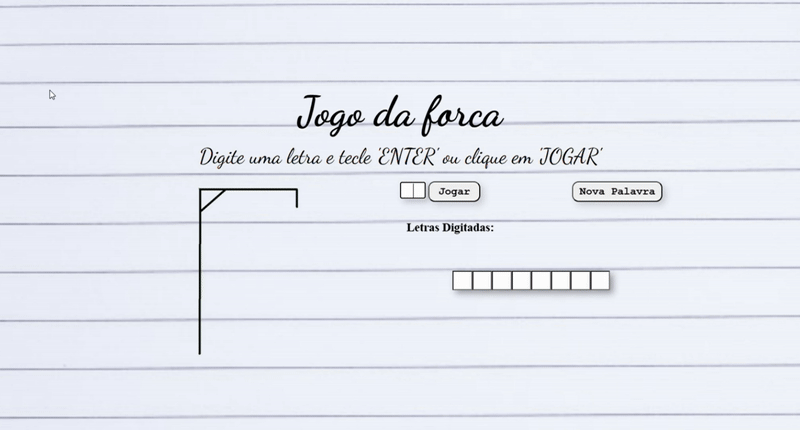

## 🎮 Jogo da Forca - HTML, CSS e JavaScript
Jogo clássico da forca desenvolvido com **HTML5**, **CSS3** e **JavaScript puro**, sem bibliotecas externas. O jogador deve adivinhar a palavra secreta digitando letras, com direito a até 7 erros. As imagens da forca são exibidas progressivamente a cada erro. Palavras carregadas de um arquivo externo via módulo ES6.

---

## 🎥 Apresentação

<p align="center">
  
</p>

---

### 🕹️ Funcionalidades

- Palavras aleatórias carregadas de um módulo externo (`palavras.js`)
- Teclado ou botão “Jogar” para interação
- Feedback visual com imagens da forca progressivamente exibidas
- Inputs dinâmicos gerados em tempo de execução
- Mensagens de vitória e derrota
- Reinício automático ao finalizar o jogo

---

### 📆 Acesse o site

Acesse o jogo online clicando no link abaixo:

👉 [Jogar agora](https://seuusuario.github.io/jogo-da-forca)

---

### 📆 Estrutura de Pastas

```
/Hangman_Game
├── index.html
├── /styles
│   ├── global.css
│   └── medias.css
├── /scripts
│   ├── index.js
│   └── palavras.js
├── /image
│   ├── forca.png
│   ├── cabeça.png
│   ├── corpo.png
│   ├── braçoE.png
│   ├── braçoD.png
│   ├── pernaE.png
│   └── pernaD.png

---

### 💻 Tecnologias usadas

- HTML5
- CSS3
- JavaScript ES6+
- DOM API
- Módulos JS (ES Modules)

---

### 📚 Aprendizados

Este projeto ajuda a fixar conceitos como:

- Modularização com ES6
- Manipulação do DOM
- Manipulação de Arrays
- Eventos de teclado
- Controle de fluxo com laços e condicionais
- Responsividade básica com CSS

---

### 📄 Licença

Este projeto está sob a licença MIT. Sinta-se livre para usar, modificar e distribuir.
